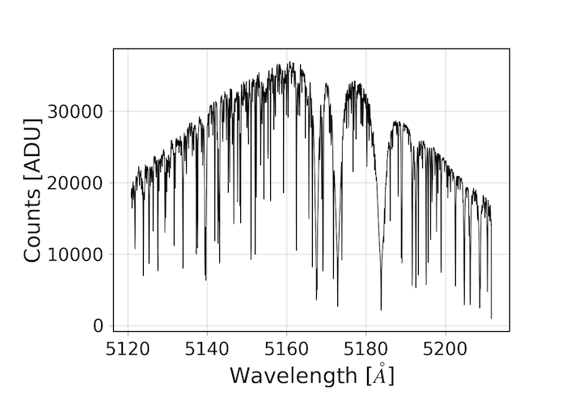

.. _outputs:

Output Data Products
====================

Radial Velocity Timeseries
++++++++++++++++++++++++++

Radial velocity timeseries data can be downloaded in CSV format using the :meth:`hiresprv.download.Download.rvcurve` method.
This table contains six columns:

.. list-table:: RV Timeseries
    :widths: 25 75 25 25 25 25
    :header-rows: 1

    * - Column name
      - Column description
      - Units
      - Type
      - Valid range
      - Null value
    * - NAME
      - Target name
      -
      - string
      - 14 characters
      - UNKNOWN
    * - BJD_TDB
      - Barycentric Julian Date in the dynamical time system
      - JD
      - float
      - -inf to +inf
      - NaN
    * - RV
      - Radial velocity
      - m/s
      - float
      - -inf to +inf
      - NaN
    * - RV_ERR
      - Radial velocity uncertainty
      - m/s
      - float
      - -inf to +inf
      - NaN
    * - BC
      - Barycentric correction
      - m/s
      - float
      - -inf to +inf
      - NaN
    * - ADU
      - Signal near 5500 Angstroms
      - ADU
      - float
      - 0 to +inf
      - NaN
    * - CHI
      - Median chi-squared from the doppler fitting
      -
      - float
      - 0 to +inf
      - NaN

Wavelength Solution
+++++++++++++++++++

Here we provide a standard wavelength solution. Due to the strict requirements on the instrument configuration, this
static wavelength solution is good to ±1 pixel for any observed spectrum.

:download:`keck_rwav.fits <_static/keck_rwav.fits>`

See below for an example of reading and interpreting this wavelength solution.

Extracted Spectra
+++++++++++++++++
Use the :mod:`hiresprv.download` module to access and download the 1D extracted spectra onto your local disk.

The extracted spectra are available as single-extension FITS files. One file will be produced for each observation.
The FITS file contains an array with dimensions 16 x 4021.
Headers for these files are copied directly from the original echellegram images as downloaded from KOA.
The value at each location in the array corresponds to the ADU counts summed over the spatial dimension of each
spectral trace. These arrays can be loaded along with the wavelength solution files in order to associate them
with a rough wavelength calibration.

Example Reading Spectrum
++++++++++++++++++++++++
Example python code to plot the order containing the Mg B triplet:

.. code-block:: python

    In [1]: import hiresprv.download

    In [2]: from astropy.io import fits

    In [3]: import pylab as pl

    In [4]: dl = hiresprv.download.Download('./prvcookie.txt')

    In [5]: dl.spectrum('20091231.123')

    In [6]: spectrum = fits.getdata(dl.filepath)

    In [7]: wavelength = fits.getdata('http://caltech-ipac.github.io/hiresprv/_static/keck_rwav.fits')

    In [8]: pl.plot(wavelength[2,:], spectrum[2,:], 'k-')

    In [9]: pl.xlabel('Wavelength [$\AA$]')

    In [10]: pl.ylabel('Counts [ADU]')

    In [11]: pl.show()

