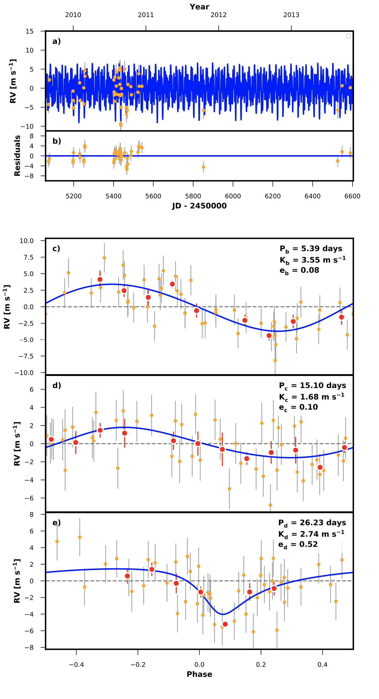

.. _performance:

Velocity Precision
******************

PRV measurements at the level of 1 m/s requires measuring the positions of stellar spectral lines to 1/1000th of a pixel
and 10 parts-per-billion precision on the redshift of the target star. These extreme precision requirements make the pipeline
very sensitive to details like the version of IDL and the machine architecture on which the base code runs. For this reason, we conducted
a study comparing the velocities output by the NExScI HIRES-PRV pipeline to archival PRV analysis of the same spectra.

.. figure:: _static/one_to_one.png
    :width: 40%
    :align: center
    :alt: velocity comparison plot

    Archival PRV value vs. PRV value from the NExScI HIRES-PRV service.

PRVs produced by the NExScI service agree with archival PRVs derived from the same spectra to within 1-sigma 66.6% of the time,
which indicates that the error bars on individual measurements accurately reflect the uncertainty within the pipeline. There is no systematic
trend or offset in the NExScI PRVs compared to the archival PRVs.

The standard deviation of the velocities for a set of standard stars over long timescales (~1 year) is essentially equivalent.
Velocities have been binned in 8 hour bins for this comparison which helps to mitigate stellar activity/jitter.

.. list-table:: PRV Performance
    :widths: 20 20 20 20 20
    :header-rows: 1
    :align: center

    * - Star name
      - NExScI RMS (m/s)
      - NExScI Mean Unc. (m/s)
      - Archival RMS (m/s)
      - Archival Mean Unc. (m/s)
    * - HD 10700
      - 1.9
      - 0.7
      - 1.8
      - 0.7
    * - HD 9407
      - 2.1
      - 0.7
      - 2.0
      - 0.6
    * - HD 185144
      - 1.9
      - 0.6
      - 1.7
      - 0.6

We demonstrated the ability to detect the PRV signatures of small planets by analyzing one year of archival data collected
on the stars HD 7924. This star is known to host three small planets (`Howard et al. 2009 <http://adsabs.harvard.edu/cgi-bin/nph-data_query?bibcode=2009ApJ...696...75H&db_key=AST&link_type=ABSTRACT>`_;
`Fulton et al. 2015 <http://adsabs.harvard.edu/cgi-bin/bib_query?arXiv:1504.06629>`_). We use `RadVel <http://radvel.readthedocs.io>`_ to fit the data, seeding the fit
with the known orbital periods. We can successfully recover the correct velocity semi-amplitude (K) and mass for planet b with only ~75% of the data presented
in `Howard et al. (2009) <http://adsabs.harvard.edu/cgi-bin/nph-data_query?bibcode=2009ApJ...696...75H&db_key=AST&link_type=ABSTRACT>`_. We also see suggestive evidence
for planets c & d with less than 20% of the data analyzed in `Fulton et al. (2015) <http://adsabs.harvard.edu/cgi-bin/bib_query?arXiv:1504.06629>`_.

    Fit results for HD 7924.

