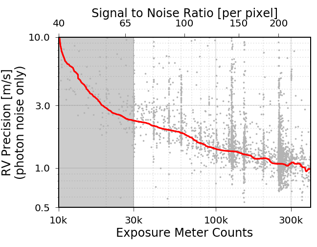
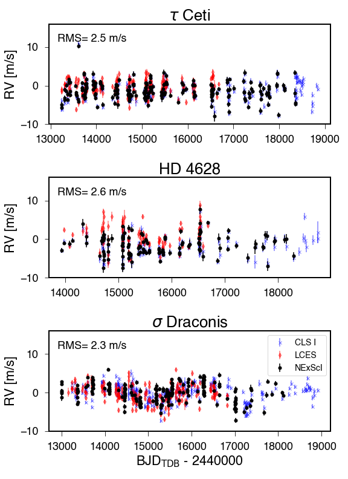
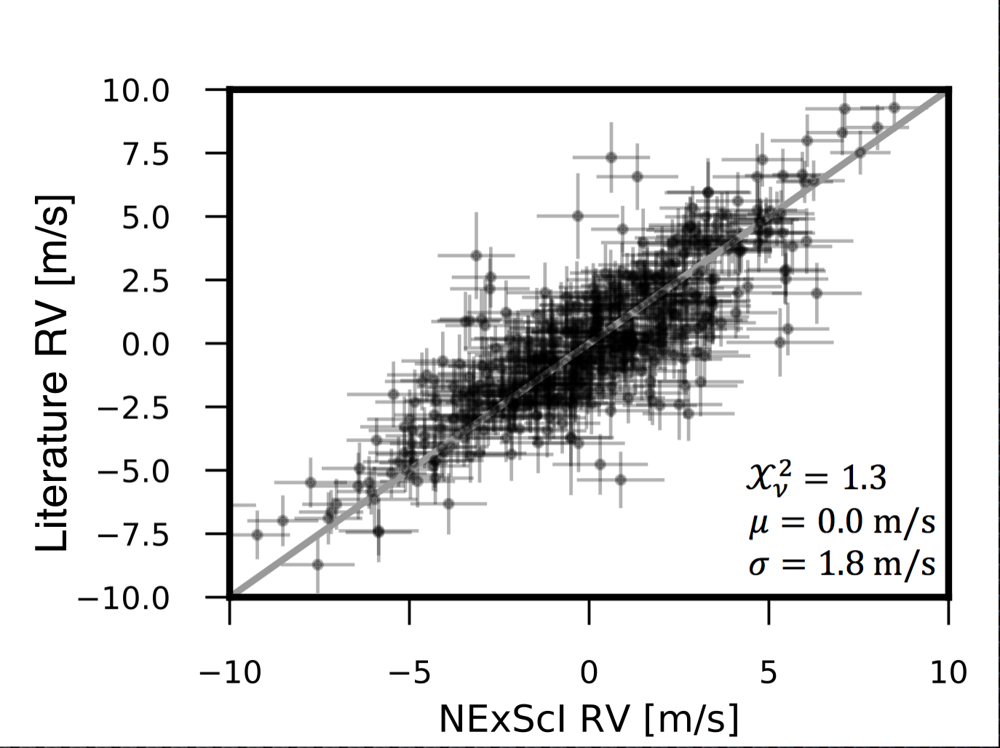
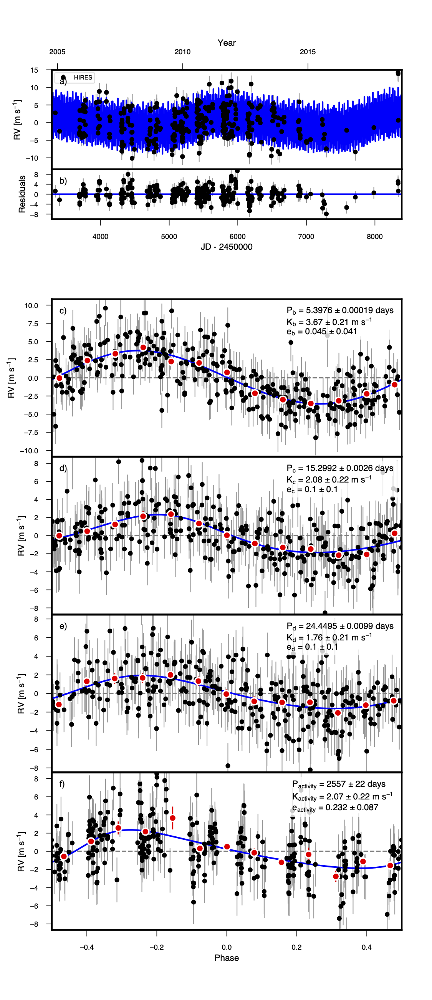

.. _performance:

Velocity Precision
=================

Consult the plot below when considering exposure times needed to achieve a desired RV precision. This does not
factor in any additional sources of instrumental and/or astrophysical noise.

    Photon-limited single measurement precision as a function of exposure meter setting and signal to noise ratio.
    The red line traces the lower 30th percentile of the individual measurements shown in grey. Signal to noise ratios
    below 70 (indicated with grey shading) are not officially supported by the pipeline and may produce erratic results.

RV Standard Stars
=================

One of the best metrics for assessing the performance of any PRV pipeline/instrument
is the RMS of the velocities of standard stars collected over several months or longer. The three stars
chosen for the plot below are known to show little to no radial velocity variation on these timescales.
The observed scatter in the velocities encompasses most sources of pipeline, instrumental,
and astrophysical noise. Velocities produced by the NExScI PRV processing environment show
scatter of less than 2.0 m/s for the most well-behaved targets.

    Radial velocity timeseries of several RV standard stars. The names of the stars and the RMS of the velocities are annotated
    in the figure. The plotted uncertainties do not include instrumental or astrophysical jitter.

Comparison with California Planet Search Pipeline
=================

The PRV processing environment at NExScI is closely related to the `California Planet Search (CPS) <https://exoplanets.caltech.edu>`_
pipeline so it is useful to compare the RVs produced by both pipelines. The mean difference between the RVs for
tau Ceti is -0.04 m/s and the scatter is 0.8 m/s. This scatter is significantly smaller than the typical single
measurement uncertainty (1.2 m/s).

    Comparison of the velocities produced by the NExScI PRV processing environment to the RVs produced by the
    California Planet Search version of the pipeline.

Known Planet Recovery
=====================

We demonstrated the ability to detect the PRV signatures of small planets by analyzing one year of archival data collected
on the star HD 7924 in addition to the sample nights referenced in the :ref:`tutorial <data_reduction_overview>`.
This star is known to host three small planets (`Howard et al. 2009 <http://adsabs.harvard.edu/cgi-bin/nph-data_query?bibcode=2009ApJ...696...75H&db_key=AST&link_type=ABSTRACT>`_;
`Fulton et al. 2015 <http://adsabs.harvard.edu/cgi-bin/bib_query?arXiv:1504.06629>`_). We use `RadVel <http://radvel.readthedocs.io>`_
to fit the data, seeding the fit with the known orbital periods. We can successfully recover the correct velocity
semi-amplitude (K) and mass for planet b with only ~75% of the data presented in
`Howard et al. (2009) <http://adsabs.harvard.edu/cgi-bin/nph-data_query?bibcode=2009ApJ...696...75H&db_key=AST&link_type=ABSTRACT>`_.

    Fit results for HD 7924.
